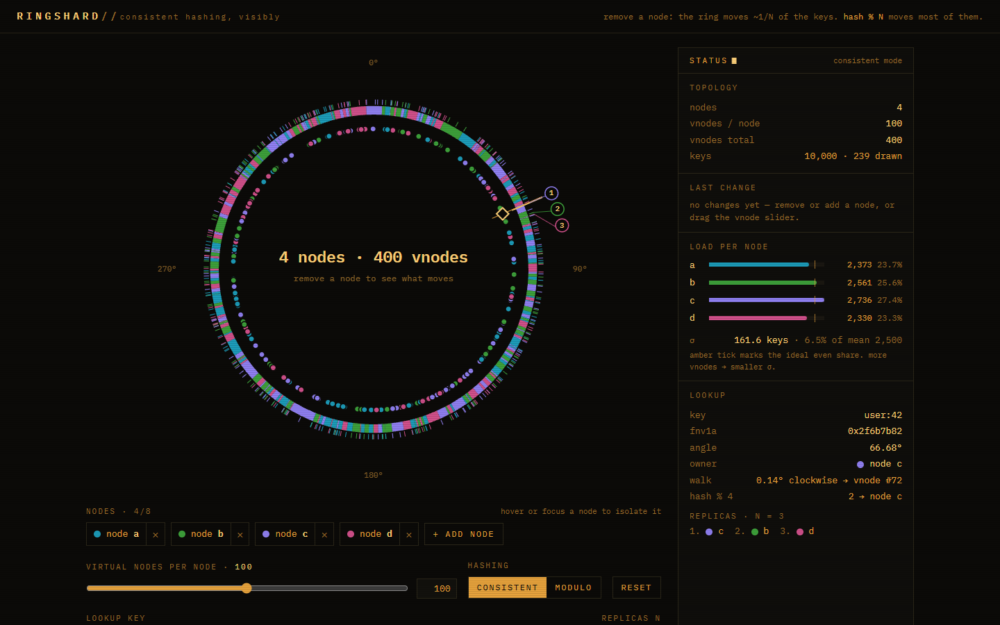
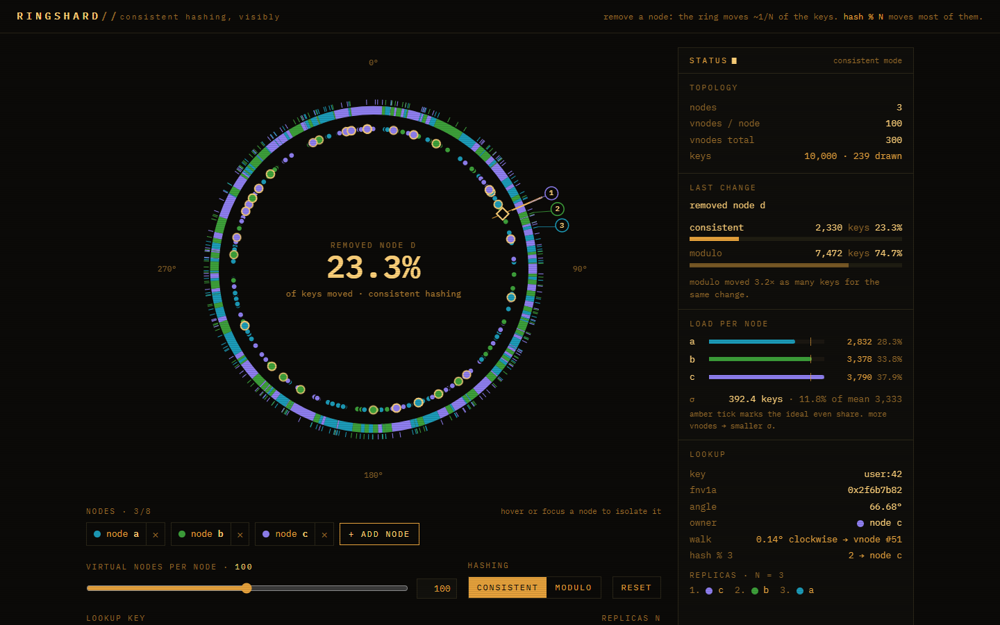
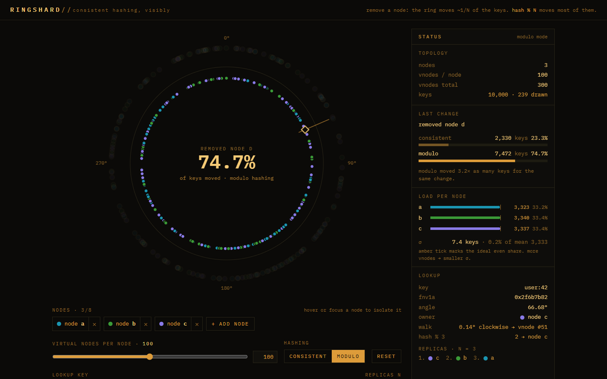

# Ringshard

A consistent-hashing ring where you add and remove nodes and see exactly which
keys move, versus the carnage of modulo hashing.



Remove one of four nodes and roughly a quarter of the key dots light up and
slide clockwise to their new owner. Flip the same change to `hash % N` and
three quarters of them scatter.

| consistent hashing: `removed node d`, 23.3% of keys moved | modulo hashing: the same change, 74.7% moved |
| :-: | :-: |
|  |  |

## Features

- **FNV-1a 32-bit** hash written from scratch; every key and every virtual
  node is placed on a 360° SVG ring by its hash.
- **Add / remove nodes** (up to eight) with a configurable **virtual-node count
  (1–200)**. Each node keeps a fixed hue for its arcs, ticks and dots for as
  long as it lives, so removing a neighbour never repaints the survivors.
- **Key lookup**: type any key (or click a dot) to see its hash, its angle, and
  the clockwise walk to the virtual node that owns it.
- **Remap diff** after every topology change: count and percentage of the
  10,000 sample keys that changed owner, animated as dots sliding to their new
  home.
- **Load histogram** per node with the ideal share marked, plus σ and
  coefficient of variation. Drag the vnode slider down to 1 and watch it blow up.
- **Modulo comparison** for the very same change, side by side, with the ratio
  between the two. Switch the ring into modulo mode to see the dots scatter.
- **Replication factor N**: the N distinct successor nodes for the looked-up
  key, badged on the ring and listed in the rail.
- Ops-console styling: amber phosphor on near-black, IBM Plex Mono, cool hues
  per node, blinking status cursor, `prefers-reduced-motion` respected.
  Responsive down to ~380px, fully keyboard operable.

## How it works

Every node contributes `v` virtual nodes. The label `"{i}/{node}#ring"` is
hashed with FNV-1a for `i = 0..v-1` and the resulting 32-bit values are stored
in one sorted `Uint32Array`, with a parallel `Uint16Array` of owner indices.
Ownership is the classic rule: a key belongs to the first virtual node whose
hash is greater than or equal to the key's hash, walking clockwise. A lookup is
therefore a hand-written binary search for the lower bound of the key hash,
with one twist: if the search runs off the end of the array, the key wraps
around to index 0.

```
hash space   0 ───────────────────────────────────────────────── 2^32
sorted vnodes     a₁     b₁      c₁    a₂        d₁     b₂      c₂
                  ▲      ▲       ▲     ▲         ▲      ▲       ▲
key k  ───────────────────────► k      owner = c₁, the first vnode ≥ k
key k' ──────────────────────────────────────────────────────────► k'
                                       nothing ≥ k' → wraps to a₁
remove node d:   only keys in (a₂, d₁] change hands, and they all go to b₂
```

When a node leaves, only the keys that sat in the arcs just before *its*
virtual nodes have to move, and they move to whichever vnode comes next
clockwise. With four nodes at 100 vnodes each, that is about 25% of the keys
(23.3% on the built-in sample; the test asserts 18–32%). Under `hash % N`,
shrinking from 4 to 3 slots reshuffles every key whose `hash mod 4` and
`hash mod 3` disagree, which is about 75% of them. Both figures are computed
the honest way: the app keeps the previous owner map for all 10,000 keys,
rebuilds the ring, and diffs.

Two details matter for a good-looking ring. First, FNV-1a's high bits track the
last input byte almost linearly, so hashing `node#0 … node#99` puts a node's
vnodes in a tight cluster and one node can own 40% of the circle; putting the
counter *first* in the label fixes that, bringing the load CV down from ~0.43
to ~0.08. Second, the replication walk simply continues past the owner,
collecting the first N *distinct* nodes it meets, so a node with several
adjacent vnodes is never counted twice.

## Run it

```sh
npm install
npm run build      # tsc -b && vite build  → dist/
npm run preview    # serve dist/
npm test           # vitest: hash vectors, remap bounds, wraparound, modulo, load stats
```

## Tech

Vite 8 · React 19 · TypeScript 6 (strict) · Tailwind CSS 4 · Vitest 5 ·
IBM Plex Mono via `@fontsource`. No charting or animation libraries: the ring
is hand-built SVG and the moved-key animation is a CSS `rotate()` keyframe on
each dot.

## License

MIT © 2026 Jafn
